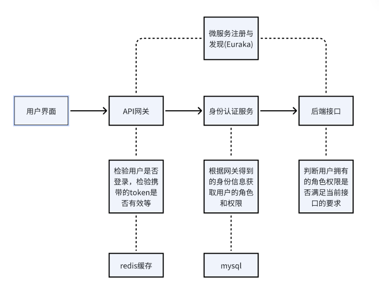

# 用户角色管理后端
## 项目介绍
用户角色管理后端，使用的模型为RBAC模型(基于角色的访问控制)。以下是项目的主要技术栈：
- Spring Boot 2: 项目的基础框架
- MyBatis-Plus: 持久层框架
- MySQL: 数据库
- Redis: 缓存
- JWT: 用户认证
- Swagger 2: API文档，本项目使用了Knife4j替代Swagger-ui
- Spring Security: 安全框架

## 用户角色管理流程

用户前端发送请求到api网关(gateway模块)，在网关中主要做路由分发、判断用户登录状态等功能。一些token的黑名单等则是由api网关这个模块保存在redis中。如果发现用户携带的token已过期或是伪造的token，则直接拦截下来将错误返回给前端。

然后是身份认证服务，这部分由spring security完成，根据网关返回的身份信息获取用户的角色和权限，并存储在整个请求的上下文中。

最后是到具体的后端接口，通过security提供的注解可以很方便的限制特定接口的权限，验证用户所具有的权限是否满足该接口的要求(例如`@PreAuthorize`)。

## 项目结构
- eureka: 服务注册中心
- gateway: api网关模块, 在redis中保存过期token、需要刷新权限的token等信息
- user: 用户模块, 包含用户的登录注册以及用户管理等功能
- common: 通用模块, 包含一些通用的工具类、异常处理等。由于`spring-cloud-starter-gateway`与`spring-boot-starter-web`冲突，所以在gateway并不包含该模块
- 其他模块: 根据具体的业务需求，可以添加更多的模块

## 代码规范
1. 代码格式使用idea默认的格式化规范(使用`Ctrl+Alt+L`格式化代码)，idea出现的黄色警告尽量都解决掉。
2. 接口命名规范遵循`RESTful`风格，详细规范可在网上查找。
3. 返回数据格式统一使用`com.example.common.vo.ResponseVO`类，文件流等特殊情况除外。
4. 数据库尽量遵循只增不减的原则，用状态改变来代替删除。所以一般查询需要过滤掉状态为删除的数据。
5. 代码中尽量不要出现魔法值，将其提取到常量类中。
6. 任何接口都需要考虑到异常输入，尤其是注意避免SQL注入、访问越权等问题。`Mybatis-Plus`中提供了很多方法可以避免SQL注入问题（例如`QueryWrapper`、`#{}占位符`等）。访问越权问题则需要在业务逻辑中进行判断，例如如果传入非本人可访问的资源id则需要判断并阻止。
7. 涉及数据库修改的操作，需要以事务的方式进行，例如使用`@Transactional`注解等方式。新增或修改数据时需要避免异常输入被写入数据库，所以需要对数据进行校验。

## 项目启动
1. 首先需要安装MySQL和Redis，并且在`application.yml`中配置好数据库和redis的连接信息。(当前使用的mysql版本为8.x，redis版本为3.x)
2. 在mysql中执行项目根目录下的SQL/table.sql和SQL/insert_data.sql文件，创建数据库和表以及插入一些测试数据。
3. 启动eureka模块，然后启动其他模块即可。
4. 访问`http://localhost:8761`可以查看eureka的服务注册情况，访问`http://localhost:8090/doc.html`可以查看swagger文档。

## 项目部署
1. 在gateway和common模块中，其config模块下均存在`DevConfig.java`配置类，建议生产环境将其中的配置项均设置为true。
2. 打包项目。
```shell
mvn clean package
```
3. 将打包好的jar包上传到服务器，使用`nohup java -jar xxx.jar &`命令启动项目。
